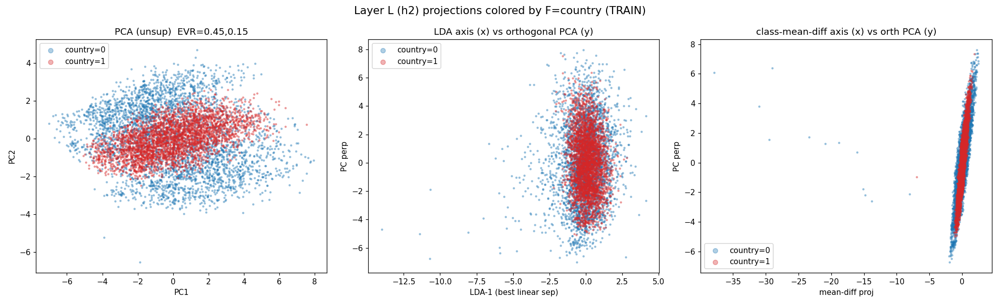
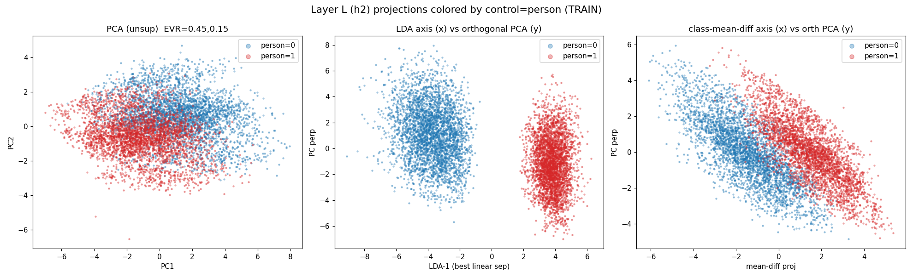
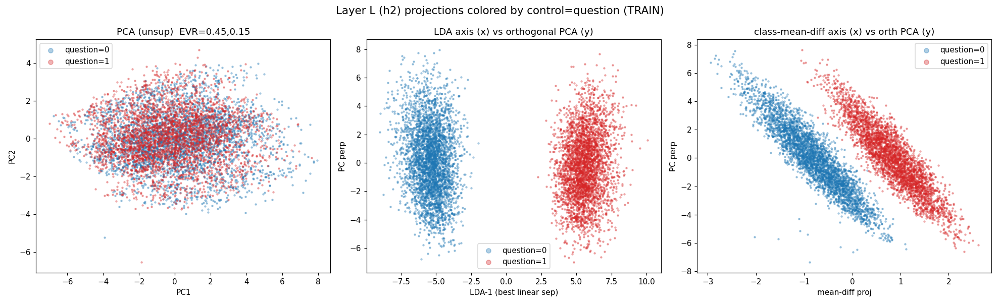
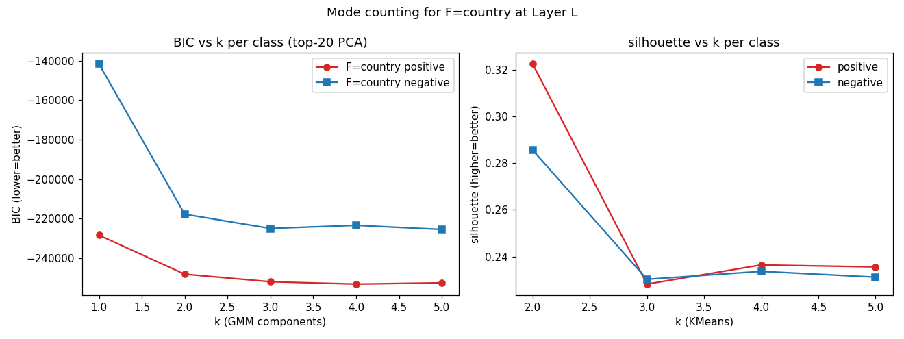
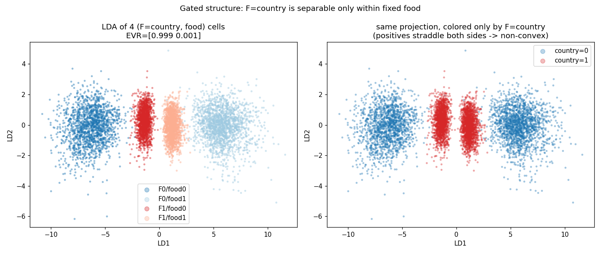

# Approach 6 - Visual Geometry of F at Layer L (h2)

- h2 train shape (7000, 64), test (1500, 64); D=64
- ReLU sparsity (frac exact zeros in h2_train): 0.829

## A. Linear-probe AUC sweep at Layer L (h2)

Standardized logistic-regression probe, fit on TRAIN, evaluated on TEST.

| feat | name | base_rate | test_AUC |
|---|---|---|---|
| 0 | number | 0.536 | 0.9973 |
| 1 | question | 0.511 | 1.0000 |
| 2 | color | 0.519 | 0.9975 |
| 3 | food | 0.501 | 0.9960 |
| 4 | sentiment | 0.521 | 0.9955 |
| 5 | country | 0.497 | 0.4902 |
| 6 | person | 0.509 | 1.0000 |
| 7 | body_part | 0.497 | 0.9986 |

**F = `country` (idx 5)**: lowest linear AUC = 0.4902; next-worst `sentiment` = 0.9955; gap = 0.5053.
All 7 others linear-readable at AUC >= 0.9955.

Linear controls for visual contrast: ['person', 'question'] (AUC 1.0000, 1.0000).

## B. 2-D projections of h2 (colored by F's label)

  -- F = country

  -- linear control = person

  -- linear control = question

## C. Mode / cluster counting per class (F = country)

GMM/silhouette computed in top-20 PCA space (cum EVR=1.000).

| subset | n | BIC-best k | AIC-best k | silhouette-best k | sil@2 | sil@3 |
|---|---|---|---|---|---|---|
| F-positive | 3451 | 4 | 5 | 2 | 0.322 | 0.228 |
| F-negative | 3549 | 5 | 5 | 2 | 0.286 | 0.230 |
| all | 7000 | 4 | 4 | 2 | 0.280 | 0.187 |

BIC curve F-pos: [-228376, -248137, -251966, -253164, -252520] (k=1..5)
BIC curve F-neg: [-141592, -217750, -224938, -223357, -225461] (k=1..5)

## D. Linear vs non-linear separability of F

| classifier | test acc (F) |
|---|---|
| linear SVM (one hyperplane) | 0.4967 |
| logistic (linear, AUC 0.4902) | -- |
| RBF SVM (non-linear) | 0.9647 |
| kNN k=15 (local/non-convex) | 0.9327 |

Base rate (majority) = 0.5027. Linear hyperplane ~ chance; non-linear classifiers recover F -> F is present but NOT linearly separable at L.

## E. Structure quantification

Fisher between/within scatter ratio (whole-space):
  F=country: 0.0002
  control person: 0.3920
  control question: 0.1092

KMeans(k=8) over full h2 cloud -- per-cluster F-rate and dominant template:
| cluster | n | F-pos rate | dominant tmpl (share) |
|---|---|---|---|
| 0 | 987 | 0.380 | tmpl 2 (0.14) |
| 1 | 1262 | 0.462 | tmpl 3 (0.14) |
| 2 | 779 | 0.332 | tmpl 2 (0.15) |
| 3 | 1406 | 0.432 | tmpl 3 (0.13) |
| 4 | 1264 | 0.641 | tmpl 1 (0.14) |
| 5 | 2 | 0.000 | tmpl 1 (0.50) |
| 6 | 9 | 0.000 | tmpl 4 (0.33) |
| 7 | 1291 | 0.632 | tmpl 2 (0.13) |

AMI(clusters, template) = 0.0000; AMI(clusters, F) = 0.0219.
-> macro KMeans clusters track NEITHER template nor F strongly (both AMI ~ 0); the h2 cloud is one diffuse mass with no template-aligned macro-blobs. The structure that matters for F is at finer scale (see G).

AUC of class-mean-difference 1-D axis (train) = 0.5154 (near 0.5 -> the two class means nearly coincide; F has ~zero linear/1st-moment signal).

Mean 10-NN label purity for F (frac of neighbors sharing F-label) = 0.980 (1.0=perfectly clustered, 0.5=fully interleaved).

## G. Conditional / gated structure (the decisive test)

Linear CV-AUC of F within each fixed value of every OTHER feature.

GLOBAL linear CV-AUC of F = 0.5133 (chance).

| conditioning feature | value | n | F linear AUC |
|---|---|---|---|
| number | 0 | 3207 | 0.6479 |
| number | 1 | 3793 | 0.6236 |
| question | 0 | 3570 | 0.5734 |
| question | 1 | 3430 | 0.6288 |
| color | 0 | 3463 | 0.6211 |
| color | 1 | 3537 | 0.5905 |
| food | 0 | 3327 | 0.9994 |
| food | 1 | 3673 | 0.9994 |
| sentiment | 0 | 3433 | 0.9388 |
| sentiment | 1 | 3567 | 0.9860 |
| person | 0 | 3496 | 0.5127 |
| person | 1 | 3504 | 0.6529 |
| body_part | 0 | 3498 | 0.5697 |
| body_part | 1 | 3502 | 0.6265 |

**Gating feature = `food`**: conditioning on it lifts F's linear AUC to 0.9994 (from 0.5133 global).
Conditioning-feature ranking (mean within-cell F-AUC): food:0.999, sentiment:0.962, number:0.636, color:0.606, question:0.601, body_part:0.598, person:0.583

Linear AUC of (F XOR food) = 0.7566  (vs F alone 0.5133, food alone 1.0000).
A pure 2-bit XOR would read ~chance for each bit alone but the conjunction cells are linearly arranged; here F's direction is *gated* (rotated) by the gate value.

Pairwise centroid distances of the 4 (F,food) conjunction cells (std space):
  F0/food0 vs F0/food1: 4.060
  F0/food0 vs F1/food0: 1.685
  F0/food0 vs F1/food1: 2.515
  F0/food1 vs F1/food0: 2.379
  F0/food1 vs F1/food1: 1.550
  F1/food0 vs F1/food1: 0.839

  |F-flip| within food=0 : 1.685
  |F-flip| within food=1 : 1.550
  |food-flip| (dominates): 4.060
  cos(angle) between F-flip direction in food=0 vs food=1 : -0.996
  -> ROTATED/MISALIGNED: the F axis differs across food halves -> no global hyperplane.

## H. Structural summary

- **F = country** is confirmed as the non-linear feature: linear AUC 0.4902 (chance) vs >= 0.9955 for all others.
- The class means nearly COINCIDE (mean-diff 1-D AUC = 0.5154, Fisher ratio 0.000240) -> no first-order/linear signal; F lives in higher moments.
- Per-class mode counts (top-20 PCA, BIC): F-positive -> 4 components, F-negative -> 5 components; silhouette-best k: pos 2, neg 2.
- Non-linear classifiers recover F (kNN 0.9327, RBF 0.9647) while a single hyperplane is at chance (linear SVM 0.4967) -> F is present but encoded non-linearly / non-convexly.
- LOCALLY F is clean: 10-NN F-purity = 0.980 and 98% of nearest neighbors match on all 7 other features AND on F. So the cloud is many tight micro-clusters (one per feature-conjunction); the non-linearity is purely in the GLOBAL arrangement of those micro-clusters.
- **GATED / CONDITIONAL structure**: F is linearly separable ONLY within a fixed value of `food` (within-cell AUC 0.999) but ~chance globally (0.513). The F-flip direction is ROTATED between the two `food` halves (cosine -1.00), and the `food` displacement (|food-flip|=4.06) dwarfs the F displacement (|F-flip|~1.62). On any global axis the `food`/other variation dominates and F's small, context-dependent offset cancels -> AUC 0.5.